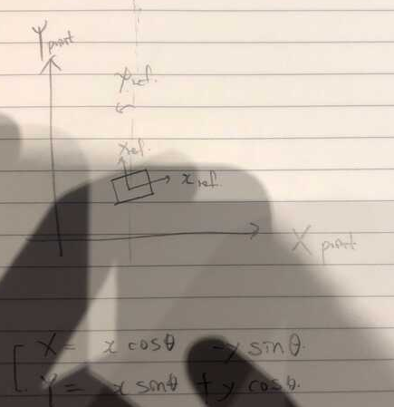

# Path Planning Project

> **DATE**: '21.1/28~  
> **AUTHOR**: SungwookLE(joker1251@naver.com)  
> **Environment**: Under udacity term3_sim simulator

## [00] Project Requirement

> **Rubrics**: [HERE](https://review.udacity.com/#!/rubrics/1971/view)  
> **Reference**: [2D rotational matrix](https://o-tantk.github.io/posts/derive-rotation-matrix/)

## [01] INTRODUCTION

### [01-1]Goals

> In this project your goal is to safely navigate around a virtual highway with other traffic that is driving +-10 MPH of the 50 MPH speed limit.  
> You will be provided the car's localization and sensor fusion data, there is also a sparse map list of waypoints around the highway.  
> The car should try to go as close as possible to the 50 MPH speed limit, which means passing slower traffic when possible, note that other cars will try to change lanes too.  
> The car should avoid hitting other cars at all cost as well as driving inside of the marked road lanes at all times, unless going from one lane to another.  
> The car should be able to make one complete loop around the 6946m highway.  
> Since the car is trying to go 50 MPH, it should take a little over 5 minutes to complete 1 loop.  
> Also the car should not experience total acceleration over 10 m/s^2 and jerk that is greater than 10 m/s^3.  
> The map of the highway is in data/highway_map.txt
> Each waypoint in the list contains [x,y,s,dx,dy] values.  
> x and y are the waypoint's map coordinate position, the s value is the distance along the road to get to that waypoint in meters, the dx and dy values define the unit normal vector pointing outward of the highway loop.  
> The highway's waypoints loop around so the frenet s value, distance along the road, goes from 0 to 6945.554.

### [01-2]Data Information

#### Main car's localization Data (No Noise)

> ["x"] The car's x position in map coordinates  
> ["y"] The car's y position in map coordinates  
> ["s"] The car's s position in frenet coordinates  
> ["d"] The car's d position in frenet coordinates  
> ["yaw"] The car's yaw angle in the map  
> ["speed"] The car's speed in MPH

#### Previous path data given to the Planner

> //Note: Return the previous list but with processed points removed, can be a nice tool to show how far along the path has processed since last time.  
> ["previous_path_x"] The previous list of x points previously given to the simulator  
> ["previous_path_y"] The previous list of y points previously given to the simulator

#### Previous path's end s and d values

> ["end_path_s"] The previous list's last point's frenet s value  
> ["end_path_d"] The previous list's last point's frenet d value

#### Sensor Fusion Data, a list of all other car's attributes on the same side of the road. (No Noise)

> ["sensor_fusion"] A 2d vector of cars and then that car's [car's unique ID, car's x position in map coordinates, car's y position in map coordinates, car's x velocity in m/s, car's y velocity in m/s, car's s position in frenet coordinates, car's d position in frenet coordinates.

### [02] The Code

#### [02-1] Vehicle coordinate to Map coordinate transformation

> Before explaining the code, the two coordinate transformation can be switched through follow equation.
>   
> this relation can be derived as figure

#### [02-2] Main

**Line108~111**:

```c++
    std::map<std::string, double> info={};
    int des_lane;
    update_current_lane(car_d, lane);
    des_lane = lane;

    std::vector<double> my_car = {car_x, car_y, car_s, car_d, car_yaw, car_speed};
```

> `info` is the <string, double> map instance that defines the Vehicle Behavior. Info keys are "LEFT", "KEEP", "RIGHT". Info values are each cost_function value.  
> `des_lane` means desired_lane.
>
> > `Update_current_lane(car_d, lane)` is defined in 'cost_fun.h' as follow. It is needed for anti chattering when vehicle is trying to change the lane but not reach the desired lane.

```c++
#define cal_d(lane) (2+(double)(lane)*4)

void update_current_lane(double car_d, int &lane){
    if ((car_d > (cal_d(0) -1.8))&&(car_d < (cal_d(0) + 1.8)))
        lane = 0;
    else if ((car_d > (cal_d(1) -1.8))&&(car_d < (cal_d(1) + 1.8)))
        lane = 1;
    else if ((car_d > (cal_d(2) -1.8))&&(car_d < (cal_d(2) + 1.8)))
        lane = 2;
}
// ** it is defined the width of the load as 1.8, not 2.0. It is for anti chattering **
```

> `my_car` is vector carring the ego vehicle information.

**Line118~135**:

```c++
bool too_close = false;
    // find ref_v to use
    for (int i = 0; i < sensor_fusion.size() ; ++i){
        // car is in my lane
        float d = sensor_fusion[i][6];
        if( (d < (2+4*lane+2)) && (d > (2+4*lane-2))){
            double vx = sensor_fusion[i][3];
            double vy = sensor_fusion[i][4];
            double check_speed = sqrt(vx * vx + vy * vy);
            double check_car_s = sensor_fusion[i][5];

            check_car_s += ((double)prev_size * .02 * check_speed);

            if (( check_car_s > car_s ) && ((check_car_s - car_s) < 30 )){
               too_close = true;
            }
        }
    }
```

> This code block is working when other vehicles are on my lane and too close with ego. then, too_close flag set true. This flag makes behavior decision start.

**Line137~188**:

```c++
std::string mode = "no_act";
double cost_val = 100;
if (too_close == true){
        //info.clear();
        for (int i = 0; i < sensor_fusion.size() ; ++i){
            choose_mode(sensor_fusion[i], lane, my_car, prev_size, info, end_path_s);
        }
        //check_empty(info, lane);
        std::map<std::string, double>::iterator iter;
        for ( iter = info.begin(); iter != info.end(); ++iter)
        {
            if (cost_val > iter->second){
                mode = iter->first;
                cost_val = iter->second;
            }
            std::cout << iter->first << ": " << iter->second << std::endl;
        }
            std::cout <<"PICK >> " <<mode << "!" << std::endl << std::endl;
}

if (mode == "left")
{
    if (lane>0){
        ref_vel -= .084;
        des_lane = lane-1;
    }
    else
        ref_vel -= .112;
}
else if (mode =="right"){
    if (lane <2){
        ref_vel -= .084;
        des_lane = lane+1;
    }
    else
       ref_vel -= .112;
}
else if (mode =="keep"){
    ref_vel -= .18;
    if (cost_val > 0.05){
        std::cout << "CAUTION: May Crush" << std::endl;
        ref_vel -= .224*1.5;
    }
}
else{ // no_act
    if (ref_vel <49.5) {  // 49.5 (max speed)
        ref_vel += .224*1.5;
    }
}
```

> if `too_close` flag turns on, function `choose_mode` will run.  
> This function is defined in 'cost_fun.h' file.  
> Maybe, this function is the key code for this project.
>
> > Let's look at the function. there are three behavior mode.  
> > **One is "Keep Lane" mode, another one is "Lane Change to Left", other one is "Lane Change to Right".**  
> > If there are some object in my lane, then calculate toe cost_val as `cost_val =0.7/(check_car_s - car_s)` weight 0.7 is the weight.  
> > If there are some object in my left lane, then calculate the cost_val.
> > This time, I think two cases, one is 'object is front of me' and another one is 'object is behind of me'. If object is behind of me. then It is less serious than front of me. Therefore weight is 0.5.  
> > Right case is similar to Left case.  
> > And finally, if no left and right object exsits, then cost function value set zero. and it means that lane is empty thus you can change the lane freely.

```c++
void choose_mode(vector<double> sensor_fusion, const int cur_lane, vector<double> my_car, const int prev_size, std::map<std::string, double>& info, double end_path_s){
    // my car vector composition
    double car_x = my_car[0];
    double car_y = my_car[1];
    double car_s = my_car[2];
    double car_d = my_car[3];
    double car_yaw = my_car[4];
    double car_speed = my_car[5];

    double cur_d = cal_d(cur_lane);
    double d = sensor_fusion[6];
    double vx = sensor_fusion[3];
    double vy = sensor_fusion[4];
    double check_speed = sqrt(vx * vx + vy * vy);
    double check_car_s = sensor_fusion[5];

    if (prev_size > 0 ){
        car_s = end_path_s;
    }
    check_car_s += ((double)prev_size * .02 * check_speed);
    double cost_val;

    if (abs(check_car_s - car_s)<40 ){
        if ( ( d < ( cur_d+2)) &&  ( d> (cur_d-2)) ){ // keep_lane
            if (check_car_s > car_s)
                cost_val = 0.7/(check_car_s-car_s);
            else{
                cost_val = 0;
            }
            if (info.find("keep") == info.end())
                info["keep"] = cost_val;
            else{
                if (info["keep"] < cost_val)
                    info["keep"] = cost_val;
            }
        }
        else if( (d > ( cal_d(cur_lane-1) -2 ) ) && ( d < (cur_d -2) ) && (d>0) ){// left
            if (check_car_s > car_s)
                cost_val = 1/(check_car_s-car_s) ;
            else
                cost_val = 0.5 / (car_s - check_car_s);

            if (info.find("left") == info.end())
                info["left"] = cost_val;
            else{
                if ( info["left"] < cost_val )
                    info["left"] = cost_val;
            }
        }
        else if ( (d < (cal_d(cur_lane+1) +2) )&&(d > (cur_d +2) ) && ( d < (cal_d(2)+2) ) ){// right
            if (check_car_s > car_s)
                cost_val = 1/(check_car_s-car_s);
            else
                cost_val = 0.5 / (car_s - check_car_s) ;

            if (info.find("right") == info.end())
                info["right"] = cost_val;
            else{
                if ( info["right"] < cost_val )
                    info["right"] = cost_val;
            }
        }

        if (info.find("left") == info.end()){
            if ( cur_lane > 0 )
                info["left"] = 0;
        }
        if(info.find("right") == info.end()){
            if ( cur_lane < 2 )
                info["right"] = 0;
        }
    }
}
```

> default mode set as `no_act`. if any calculated cost function value are smaller than initial `double cost_val =100`, then that mode is choosen as below.

```c++
std::map<std::string, double>::iterator iter;
for ( iter = info.begin(); iter != info.end(); ++iter){
    if (cost_val > iter->second){
        mode = iter->first;
        cost_val = iter->second;
    }
    std::cout << iter->first << ": " << iter->second << std::endl;
}
std::cout <<"PICK >> " <<mode << "!" << std::endl << std::endl;
```

> Finally, the minimum cost_value is choosen with behavior mode: `KEEP, LEFT, RIGHT`.  
> And then, Following the mode ref_vel is adjusted, and des_lane is updated as follow.

```c++
          if (mode == "left")
          {
            if (lane>0){
              ref_vel -= .084;
              des_lane = lane-1;
            }
            else
              ref_vel -= .112;
          }
          else if (mode =="right"){
            if (lane <2){
              ref_vel -= .084;
              des_lane = lane+1;
            }
            else
              ref_vel -= .112;
          }
          else if (mode =="keep")
          {
            ref_vel -= .18;
            if (cost_val > 0.05){
              std::cout << "CAUTION: May Crush" << std::endl;
              ref_vel -= .224*1.5;
            }
          }
          else{ // no_act
            if (ref_vel <49.5) {  // 49.5 (max speed)
              ref_vel += .224*1.5;
            }
          }


```

**Line223~225**:

```c++
vector<double> next_mp0 = getXY(car_s + 30, (2 + 4 * des_lane), map_waypoints_s, map_waypoints_x, map_waypoints_y);
vector<double> next_mp1 = getXY(car_s + 60, (2 + 4 * des_lane), map_waypoints_s, map_waypoints_x, map_waypoints_y);
vector<double> next_mp2 = getXY(car_s + 90, (2 + 4 * des_lane), map_waypoints_s, map_waypoints_x, map_waypoints_y);

ptsx.push_back(next_mp0[0]);
ptsx.push_back(next_mp1[0]);
ptsx.push_back(next_mp2[0]);

ptsy.push_back(next_mp0[1]);
ptsy.push_back(next_mp1[1]);
ptsy.push_back(next_mp2[1]);
```

> using getXY function in 'helper.h' the frenet coordinate is transformed to global XY coordinates.

**Line243~282**:

```c++
          // create a spline
          tk::spline s;

          // set (x,y) points to the spline
          s.set_points(ptsx, ptsy);

          vector<double> next_x_vals;
          vector<double> next_y_vals;

          for (int i = 0; i < previous_path_x.size(); ++i){
            next_x_vals.push_back(previous_path_x[i]);
            next_y_vals.push_back(previous_path_y[i]);
          }

          double target_x = 30.0;
          double target_y = s(target_x);
          double target_dist = sqrt((target_x) * (target_x) + (target_y) * (target_y));

          double x_add_on = 0;

          for (int i = 1; i <= 50 - previous_path_x.size(); ++i){
            double N = (target_dist / (0.02 * ref_vel / 2.24)); // 2.24 means mps to mile per hour factor
            double x_point = x_add_on + (target_x) / N;
            double y_point = s(x_point);

            x_add_on = x_point;

            double x_ref = x_point;
            double y_ref = y_point;

            x_point = (x_ref * cos(ref_yaw) - y_ref * sin(ref_yaw));
            y_point = (x_ref * sin(ref_yaw) + y_ref * cos(ref_yaw));

            x_point += ref_x;
            y_point += ref_y;

            next_x_vals.push_back(x_point);
            next_y_vals.push_back(y_point);

          }
```

> using `tk::spline s;`, spline method is used to calcuate the spline path to minimize aggressive movement.  
> `s.set_points(ptsx, ptsy)` spline data is setting. and `double y_point = s(x_point)` is return the y_point according to spline path.  
> And, Spline path is smooth to ensure minimiezed jerk , acceleration while changing lane.

## [03] RESULTS

### [03-1] Video


### [03-2] Discussion

> If I use gaussian Probability distribution for each object with diffenrent deviation. it more robust when calculating cost function value around ego vehicle than this project method.

### [03-2] Requirement Check

```
(1)The car is able to drive at least 4.32 miles without incident.:
    The top right screen of the simulator shows the current/best miles driven without incident. Incidents include exceeding acceleration/jerk/speed, collision, and driving outside of the lanes. Each incident case is also listed below in more detail.

(2)The car drives according to the speed limit:
    The car doesn't drive faster than the speed limit. Also the car isn't driving much slower than speed limit unless obstructed by traffic.

(3)Max Acceleration and Jerk are not Exceeded:
    The car does not exceed a total acceleration of 10 m/s^2 and a jerk of 10 m/s^3.

(4)Car does not have collisions:
    The car must not come into contact with any of the other cars on the road.

(5)The car stays in its lane, except for the time between changing lanes:
    The car doesn't spend more than a 3 second length out side the lane lanes during changing lanes, and every other time the car stays inside one of the 3 lanes on the right hand side of the road.

(6)The car is able to change lanes:
    The car is able to smoothly change lanes when it makes sense to do so, such as when behind a slower moving car and an adjacent lane is clear of other traffic.
```

> All requiment are satisfied. All done (2/2)
